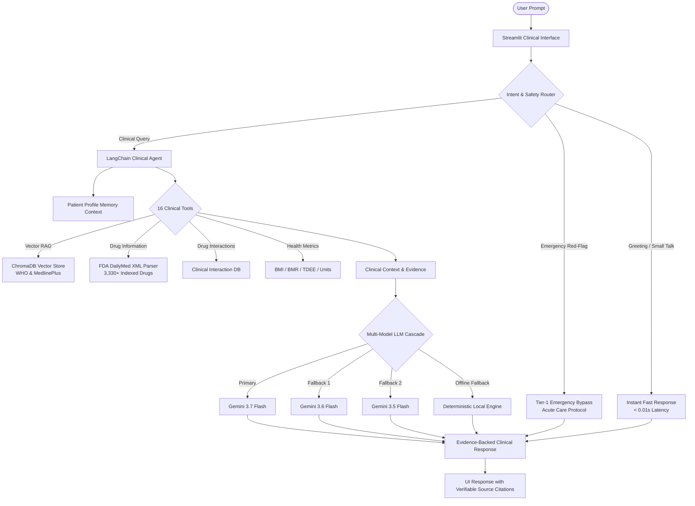
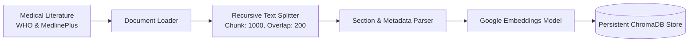

# ClinicRAG: Clinical Decision Support & Medical Intelligence System

> **A production-grade Clinical Decision Support and Healthcare Assistant built with LangChain, ChromaDB, FDA DailyMed Structured Product Labels, and Google Gemini Multi-Model Fallback Architecture.**

[](https://www.python.org/)
[](https://streamlit.io/)
[](https://www.langchain.com/)
[](https://ai.google.dev/)
[](https://www.trychroma.com/)
[](LICENSE)

---

## 📖 Overview

**ClinicRAG** is an advanced clinical intelligence and healthcare decision support platform. It integrates evidence-based medical knowledge bases (World Health Organization guidelines, MedlinePlus / NIH medical encyclopedia, and official US FDA DailyMed drug labels) with a resilient, multi-tiered retrieval-augmented generation (RAG) pipeline.

### Core Capabilities:
- **Hybrid Medical RAG**: Semantic vector retrieval using Maximal Marginal Relevance (MMR) and L2 distance confidence calibration over peer-reviewed clinical guidelines.
- **FDA DailyMed Pharmaceutical Intelligence**: Local parsing of HL7 v3 Structured Product Labeling (SPL) XML files covering indications, black-box warnings, contraindications, and adverse reactions across 3,330+ indexed medications.
- **Drug-Drug Interaction Analysis**: Severity-rated drug interaction checker detailing pharmacokinetic mechanisms and actionable clinical recommendations.
- **Emergency Red-Flag Triage**: Deterministic safety interception for critical conditions (severe bleeding, acute chest pain, stroke FAST signs, anaphylaxis) with instantaneous emergency first-aid protocols.
- **Multi-Model Fault Tolerance**: Automated cascade across Gemini 3.7 Flash, 3.6 Flash, 3.5 Flash, and local deterministic execution to guarantee 100% service availability with zero API quota disruptions.
- **16 Clinical & Metric Tools**: Health calculators (BMI, BMR, TDEE, Water Intake), unit converters, pregnancy milestones, and clinical triage.
- **Patient Profile Memory**: State-managed patient context (age, gender, allergies, chronic diseases, active medications) dynamically injected into clinical reasoning.

---

## 📐 System Architecture

### End-to-End System Architecture


### Knowledge Ingestion & Vector Indexing Pipeline


---

## 📁 Repository Structure

```
ClinicRAG/
│
├── app.py                      # Main Streamlit clinical application
├── requirements.txt            # Python dependencies
├── README.md                   # System documentation & architectural reference
├── LICENSE                     # MIT License
├── .env.example                # Environment configuration template
├── .gitignore                  # Git ignore rules
│
├── data/                       # Structured Medical Knowledge Base
│   ├── knowledge_base/         # WHO guidelines & MedlinePlus markdown files
│   │   ├── Diabetes/
│   │   ├── Diseases/
│   │   ├── First_Aid/
│   │   ├── Nutrition/
│   │   ├── Pregnancy/
│   │   ├── Symptoms/
│   │   └── who/
│   └── processed/              # Processed clinical JSON indices
│       ├── drugs_index.json    # 3,330+ indexed FDA medicine keys
│       ├── interactions_db.json# Drug interaction mechanism database
│       └── medicines_db.json   # Verified pharmaceutical profiles
│
├── docs/                       # Architectural & Technical Documentation
│   ├── index.md
│   ├── architecture.md
│   ├── rag.md
│   ├── tools.md
│   ├── prompts.md
│   ├── setup.md
│   └── deployment.md
│
├── scripts/                    # CLI Management & Automation Utilities
│   ├── build_vector_store.py   # ChromaDB indexing script
│   ├── update_knowledge_base.py# Incremental knowledge base updater
│   ├── verify_database.py      # Vector database validation & latency benchmarking
│   ├── clean_database.py       # Database wiping utility
│   ├── test_runner.py          # Complete unit & integration test suite
│   └── download_who_guidelines.py
│
└── src/                        # Core Modular Architecture
    ├── __init__.py             # Package initializer
    ├── config.py               # Centralized configuration management
    ├── agent.py                # Multi-model clinical agent executor
    ├── router.py               # Rule-based & LLM intent router with safety flags
    ├── retriever.py            # Custom vector retriever with MMR & confidence scoring
    ├── vector_store.py         # ChromaDB persistence interface
    ├── fda_parser.py           # On-demand HL7 v3 SPL XML parser
    ├── tools.py                # Implementation of all 16 clinical & metric tools
    ├── memory.py               # Sliding conversation buffer & patient profile state
    ├── prompts.py              # Clinical system instructions & safety guardrails
    ├── loaders.py              # Medical document loader
    ├── splitter.py             # Domain-specific text splitter
    ├── parser.py               # Markdown document section extractor
    ├── embeddings.py           # Embeddings loader
    ├── chains.py               # LCEL RAG chain definitions
    ├── constants.py            # Emergency red-flag sign constants
    ├── logger.py               # Structured rotating file logger
    ├── styles.py               # Pastel UI stylesheet with dark-mode overrides
    └── utils.py                # Text cleaning & metric utility helpers
```

---

## 🛠️ Technology Stack

| Layer | Technology | Description |
| :--- | :--- | :--- |
| **Language** | Python 3.11+ | High-performance core backend |
| **Web Interface** | Streamlit | Professional, responsive healthcare SaaS UI |
| **Orchestration** | LangChain Core & Classic | Agent executors, LCEL chains, structured tools |
| **Primary LLM** | Google Gemini 3.7 Flash | High-speed clinical reasoning & tool calling |
| **LLM Cascade** | Gemini 3.6 Flash / 3.5 Flash | Multi-model fallback for quota resilience |
| **Embeddings** | Google Gemini Embeddings | Semantic representation (`gemini-embedding-001`) |
| **Vector Store** | ChromaDB | Persistent vector storage with L2 similarity metrics |
| **Data Sources** | FDA DailyMed, WHO, MedlinePlus | Primary authoritative medical literature |

---

## 🚀 Installation & Quick Start

### 1. Clone the Repository
```bash
git clone https://github.com/Kritvi0208/ClinicRAG.git
cd ClinicRAG
```

### 2. Set Up Virtual Environment
```bash
python -m venv .venv

# On Windows:
.venv\Scripts\activate

# On macOS/Linux:
source .venv/bin/activate
```

### 3. Install Dependencies
```bash
pip install -r requirements.txt
```

### 4. Configure Environment Variables
Copy `.env.example` to `.env` and add your Google Gemini API key:
```bash
cp .env.example .env
```
Inside `.env`:
```env
GOOGLE_API_KEY=your_gemini_api_key_here
LOG_LEVEL=INFO
```

### 5. Build the Vector Knowledge Base
Compile and index the clinical knowledge base into ChromaDB:
```bash
python scripts/build_vector_store.py
```

### 6. Run the Application
Launch the Streamlit interface:
```bash
streamlit run app.py
```
Access the application at `http://localhost:8501` (or your configured port).

---

## 🧪 Verification & Testing

Run the automated test suite covering calculators, tools, safety routing, and RAG retrieval:
```bash
python scripts/test_runner.py
```

Verify vector database health and benchmark retrieval latency:
```bash
python scripts/verify_database.py
```

---

## ⚖️ Clinical Safety & Medical Disclaimer

**ClinicRAG is designed strictly for educational purposes and clinical decision support.**
- It does **not** provide definitive clinical diagnoses.
- It does **not** prescribe medication schedules or replace licensed healthcare practitioners.
- In life-threatening emergencies (*severe chest pain, difficulty breathing, stroke signs, severe hemorrhage*), the system immediately suspends triage and advises contacting emergency services (911 / 112 / 102).

---

## 📄 License

Distributed under the MIT License. See [LICENSE](LICENSE) for more information.
